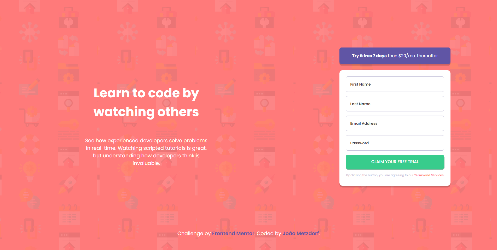

# Frontend Mentor - Intro component with SignUp

Este é um projeto de Intro component with SignUp que foi desenvolvido a partir de um desafio do Frontend Mentor.

## Visão Geral

### Desafio

Construir o Intro component com SignUp o mais próximo possível do design fornecido.

### Screenshot

### Links

- [Site](https://intro-component-with-sing-up.vercel.app/)  

## Meu processo

### Construído com

- HTML5
- CSS3
- Flexbox
- JavaScript
- Mobile-first

### O que aprendi

- Aprendi mais sobre válidação de formulários

## Autor

- Frontend Mentor - [@joaometzdorf](https://www.frontendmentor.io/profile/joaometzdorf)
- GitHub - [@joaometzdorf](https://www.github.com/joaometzdorf)
